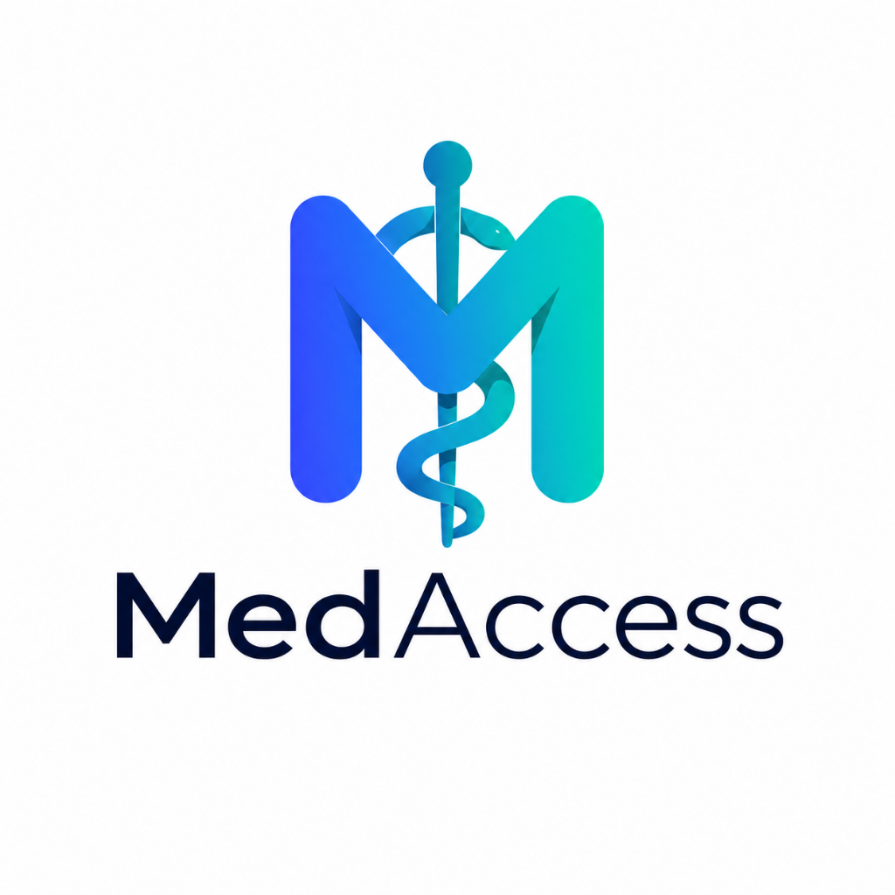
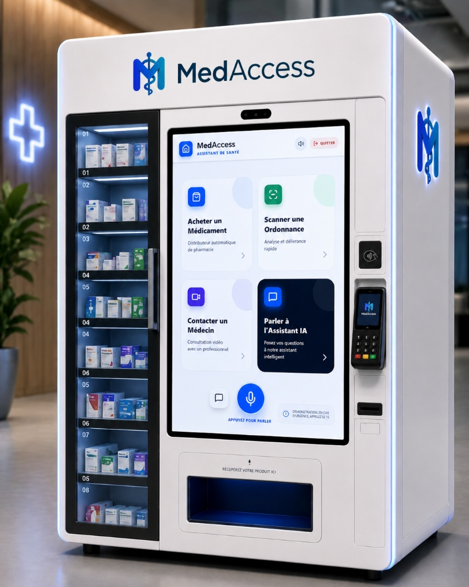

<div align="center"> 
  
  # 🩺 MedAccess
  ### *L'Assistant de Santé & Distributeur Médical Intelligent pour Pharmacies et Cliniques*
  
  **🎓 Early Engineering Project (EEP) — 2ème Année | ECE Lyon**
  
  [](https://vite.dev/)
  [](https://react.dev/)
  [](https://tailwindcss.com/)
  [](https://ai.google.dev/)
  [](https://www.typescriptlang.org/)
</div>

---

**MedAccess** est une application interactive pour borne de santé installée en pharmacie ou en clinique. Elle combine un assistant vocal intelligent propulsé par l'IA (Gemini Flash) et des services physiques simulés de pharmacie autonome. 

Grâce à une interaction multimodale fluide (voix et tactile), MedAccess permet d'orienter les patients, de délivrer des médicaments en vente libre, de scanner des ordonnances et d'organiser des téléconsultations médicales.

<div align="center">
  
</div>

---

## 🎓 Contexte du Projet

Ce projet a été conçu et développé dans le cadre du **Early Engineering Project (EEP)** de **deuxième année** au sein de l'**ECE Lyon**.

L'objectif de ce projet est d'explorer et de concevoir des solutions technologiques innovantes pour répondre à des défis sociétaux majeurs. Avec **MedAccess**, nous proposons une solution concrète pour améliorer l'accès aux soins de premier recours dans les territoires sous-médicalisés (déserts médicaux) ou pour assurer une assistance médicale et pharmaceutique continue en dehors des horaires classiques d'ouverture.

---

## 🌟 Fonctionnalités Clés

### 1. 🎙️ Assistant Vocal IA Empathique & Multimodal
* **Orientation Intelligente** : Un agent conversationnel médical qui pose des questions de clarification et conseille sur l'orientation idéale (médicament, médecin, téléconsultation).
* **Reconnaissance & Synthèse Vocale** : Intégration de la *Web Speech API* avec détection automatique de silence et réponse vocale instantanée en français.
* **Visualiseur Audio Dynamique** : Animation en temps réel reflétant l'état d'écoute et d'activité du microphone.
* **Clavier Tactile Virtuel** : Alternative accessible permettant de dialoguer par écrit grâce à un clavier conçu spécifiquement pour les écrans de bornes.

### 2. 💊 Distributeur Automatique de Médicaments
* **Catalogue de Médicaments** : Recherche et consultation de médicaments courants en vente libre (Doliprane, Gaviscon, Spasfon...) avec prix, posologie et état du stock.
* **Achat en Ligne Direct** : Parcours client simulé avec paiement sécurisé par carte et animation de distribution physique du produit.

### 3. 📄 Scanner d'Ordonnance Intégré
* **Scan par Caméra** : Utilise le flux caméra de l'appareil pour scanner instantanément les ordonnances physiques.
* **Analyse Automatique** : Extraction intelligente des médicaments prescrits et parcours direct vers la délivrance du traitement.

### 4. 📅 Portail Médical & Téléconsultation
* **Téléconsultation Immédiate** : Lancement d'un appel vidéo en direct avec un médecin de garde disponible sous 5 minutes.
* **Prise de Rendez-vous** : Visualisation interactive des créneaux disponibles pour les spécialistes et réservation en un clic avec intégration dans l'historique.

---

## 🛠️ Stack Technique

* **Framework Core** : [React 19](https://react.dev/) & [TypeScript](https://www.typescriptlang.org/)
* **Build System** : [Vite 6](https://vite.dev/)
* **Intelligence Artificielle** : [Google GenAI SDK (`@google/genai`)](https://github.com/google/generative-ai-js)
* **Modèle IA** : `gemini-flash-latest` avec fonctions outils (*Function Calling*)
* **Styles & Animations** : [Tailwind CSS v4](https://tailwindcss.com/) & [Motion (Framer Motion)](https://motion.dev/)
* **Iconographie** : [Lucide React](https://lucide.dev/)
* **Rendu Markdown** : [React Markdown](https://github.com/remarkjs/react-markdown)

---

## 📂 Structure du Projet

```bash
medaccess/
├── src/
│   ├── components/
│   │   ├── ActionCards.tsx     # Cartes UI interactives (Médicaments, Médecins, Calendrier)
│   │   ├── TouchKeyboard.tsx   # Clavier virtuel tactile sur mesure
│   │   └── VoiceVisualizer.tsx # Micro-animation du visualiseur vocal
│   ├── hooks/
│   │   └── useSpeech.ts        # Hook personnalisé pour la reconnaissance et synthèse vocale
│   ├── lib/
│   │   └── utils.ts            # Utilitaire de fusion des classes Tailwind CSS (cn)
│   ├── services/
│   │   └── geminiService.ts    # Intégration de l'API Gemini et configurations des Tools
│   ├── types.ts                # Définitions de types TypeScript de l'application
│   ├── App.tsx                 # Contrôleur principal et routeur de l'application
│   ├── index.css               # Point d'entrée des styles globaux Tailwind v4
│   └── main.tsx                # Point d'entrée de l'application React
├── .env.example                # Exemple de configuration des variables d'environnement
├── metadata.json               # Métadonnées de l'application et permissions requises
├── package.json                # Dépendances et scripts NPM
├── tsconfig.json               # Configuration du compilateur TypeScript
└── vite.config.ts              # Configuration de build et d'aliases Vite
```

---

## ⚙️ Configuration & Installation

### Prérequis
* [Node.js](https://nodejs.org/) (version 18 ou supérieure recommandée)
* Une clé d'API Google Gemini

### 1. Cloner et Installer les Dépendances
Dans votre terminal, exécutez :
```bash
npm install
```

### 2. Variables d'Environnement
Copiez le fichier `.env.example` vers un nouveau fichier nommé `.env.local` :
```bash
cp .env.example .env.local
```
Ouvrez le fichier `.env.local` et ajoutez votre clé d'API Gemini :
```env
GEMINI_API_KEY="VOTRE_CLE_API_GEMINI"
```

> [!IMPORTANT]
> Ne partagez jamais votre fichier `.env.local` et assurez-vous qu'il est bien répertorié dans votre `.gitignore`.

### 3. Lancer l'Application Localement
Démarrez le serveur de développement local :
```bash
npm run dev
```
L'application sera accessible dans votre navigateur à l'adresse suivante : [http://localhost:3000](http://localhost:3000).

---

## 🧠 Fonctionnement de l'IA (Function Calling)

L'agent conversationnel de **MedAccess** utilise la technologie de **Function Calling** de Gemini Flash pour connecter l'IA aux fonctionnalités de la borne.

Les outils enregistrés dans `src/services/geminiService.ts` incluent :
1. `get_available_slots` : Récupère les créneaux libres d'un médecin.
2. `suggest_medication` : Propose un médicament en vente libre selon les symptômes.
3. `refer_to_doctor` : Propose une recommandation de cabinet médical physique.
4. `schedule_appointment` : Confirme une prise de rendez-vous.
5. `start_telemedicine` : Déclenche la téléconsultation instantanée.

Chaque fois que l'IA détecte une intention utilisateur correspondante, elle retourne un appel de fonction qui met à jour dynamiquement l'interface utilisateur de la borne, affichant la carte de service correspondante à l'écran.

---

## 🚀 Déploiement

Pour générer les fichiers de production optimisés :
```bash
npm run build
```

Pour prévisualiser le build localement :
```bash
npm run preview
```

### Déploiement dans Google AI Studio
Cette application est configurée pour fonctionner de manière transparente avec **Google AI Studio**. Les clés d'API et variables d'environnement nécessaires sont automatiquement injectées lors de l'exécution sur la plateforme.

---

<div align="center">
  <sub>Développé avec passion pour simplifier l'accès aux soins de santé de proximité. 💚</sub>
</div>
